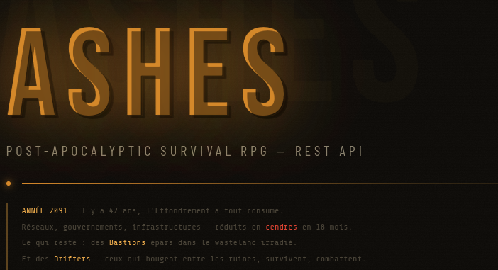

# ASHES



Post-Apocalyptic Survival RPG - REST API

## Overview

ANNEE 2091. Il y a 42 ans, l'Effondrement a tout consume.  
Reseaux, gouvernements, infrastructures - reduits en cendres en 18 mois.  
Ce qui reste: des Bastions eparpillés dans le wasteland irradié.  
Et des Drifters - ceux qui bougent entre les ruines, survivent, combattent.

ASHES est une API backend TypeScript/Express qui alimente cet univers. Ce depot contient la base technique actuelle et une partie des ressources de monde (factions, bastions, drifters, items) en donnees mock.

Game Design Doc: ce n'est pas un tutoriel. C'est une base d'architecture backend a faire evoluer vers une logique metier riche, avec des contraintes reelles et un service layer qui porte le gameplay.

## Vision Produit (Game Design Target)

ASHES est concu comme un backend de survival RPG post-apocalyptique. Les Drifters parcourent un wasteland devasté, interagissent avec des Bastions, des Factions, des contrats et du loot sous contraintes de progression et de survie.

Entites cibles du domaine:

| Domaine  | Entite        | Description cible                                               |
| -------- | ------------- | --------------------------------------------------------------- |
| Primary  | Drifter       | Joueur: classe, stats, HP, radiation, niveau, XP, poids max     |
| World    | Bastion       | Cite-etat: population, securite, faction controlante, marchands |
| World    | Faction       | Conseil / Errants / Ordre de Fer: ideologie, territoire         |
| Item     | Item          | Arme, armure, medicament, nourriture, materiau                  |
| Player   | InventorySlot | Relation Drifter-Item: quantite, equipe, condition              |
| Quest    | Contract      | Missions avec objectifs, recompenses, deadline                  |
| Quest    | ContractLog   | Progression de contrat: statut, preuves, timestamps             |
| Gameplay | Encounter     | Combat PvE turn-based avec logs et loot                         |
| Crafting | Recipe        | Transformation d'items avec prerequis                           |

Contraintes gameplay cibles:

- Classes Drifter: Scout, Soldier, Medic, Tinkerer.
- Equipement avec verification classe/niveau cote serveur.
- Combat turn-based resolu entierement par l'API.
- Inventaire limite en poids.
- Reputation faction impactant les prix marchands.
- Radiation impactant les actions disponibles.
- Crafting reserve a la classe Tinkerer.
- Contrats avec objectifs structures (JSON) et deadline.
- Systeme de rarete cible: Common -> Legendary -> Mythic.
- Evolution des stats via XP et niveau.
- Bastions avec marchands et stocks variables.

Note: ces mecaniques de design servent de direction produit; elles ne sont pas toutes implementees dans l'etat actuel du code.

Etat actuel cote typage Item: `Common | Uncommon | Rare | Epic | Legendary`.

## Tech Stack

- Node.js: le moteur (event loop, modules, process).
- TypeScript: le blindage (types statiques, generiques, inference).
- Express.js: le vehicule HTTP (routes, middleware, lifecycle de requete).
- Zod: le detecteur (validation runtime + coherence TypeScript).

## Structure Du Depot

```text
ashes-api/
├── src/
│   ├── app.ts // Express app factory
│   ├── server.ts // Bootstrap + graceful shutdown
│   │
│   ├── config/
│   │   ├── env.ts // Vars d'env validees par Zod au demarrage
│   │   └── constants.ts // DRIFTER_CLASS, ITEM_RARITY, FACTION...
│   │
│   ├── modules/
│   │   ├── auth/ // Register (choisir sa classe), Login, Refresh
│   │   ├── drifters/ // Profil, stats, level up, radiation
│   │   ├── bastions/ // World map, marchands, quetes disponibles
│   │   ├── factions/ // Reputation, territoire, bonus
│   │   ├── items/ // Catalogue d'items, rarete, stats
│   │   ├── inventory/ // Gestion inventaire, equipement, poids
│   │   ├── contracts/ // Contrats, accepter, progresser, remettre
│   │   ├── encounters/ // Combats turn-based, resolution, loot
│   │   └── crafting/ // Recettes, craft (Tinkerer only)
│   │
│   ├── middleware/
│   │   ├── errorHandler.ts // Error middleware global (4 args)
│   │   ├── authenticate.ts // JWT guard
│   │   ├── validate.ts // Middleware Zod generique
│   │   ├── requireClass.ts // Guard de classe (ex: Tinkerer only)
│   │   └── checkRadiation.ts // Bloque certaines actions si irradie
│   │
│   └── shared/
│       ├── ApiError.ts // Classe d'erreur custom typee
│       ├── ApiResponse.ts // Format de reponse uniforme
│       └── types.ts // Types globaux (DrifterClass, ItemRarity...)
│
├── package.json
├── tsconfig.json
└── .env.example
```

## Quick Start

Prerequis:

- Node.js 20+
- npm

Installation:

```bash
npm install
```

Configuration:

```bash
cp .env.example .env
```

Puis renseigner au minimum:

```bash
PORT=8000
```

Lancement en developpement:

```bash
npm run dev
```

Build + run production:

```bash
npm run build
npm start
```

Type-check uniquement:

```bash
npm run check-only
```

Base URL locale:

```text
http://localhost:8000/api/v1
```

## API Reference (Current)

| Method | Endpoint             | Description                             |
| ------ | -------------------- | --------------------------------------- |
| GET    | `/health`            | Healthcheck (`status`, `timestamp`)     |
| GET    | `/bastions`          | Liste des bastions                      |
| GET    | `/bastions/:id`      | Detail d'un bastion                     |
| GET    | `/drifters`          | Liste des drifters                      |
| GET    | `/drifters/:id`      | Detail d'un drifter                     |
| GET    | `/items`             | Liste des items                         |
| GET    | `/items/guide`       | Guide descriptif des items              |
| GET    | `/items/stats/guide` | Guide des stats des items               |
| GET    | `/factions`          | Liste des factions                      |
| POST   | `/factions`          | Creation d'une faction (validation Zod) |

Tous les endpoints ci-dessus sont prefixes par `/api/v1`.

Exemple: creation d'une faction

```bash
curl -X POST http://localhost:8000/api/v1/factions \
  -H "Content-Type: application/json" \
  -d '{
    "id": "f-11",
    "name": "Ashwalkers",
    "ideology": "Adaptive survival through mobility and salvage",
    "territory": ["Dust corridors", "Old rail depots"],
    "description": "Nomadic crews specialized in long-range scavenging."
  }'
```

Validation actuelle pour `POST /factions`:

- `id`: string
- `name`: string
- `ideology`: string
- `territory`: string[] non vide
- `description`: string

Comportement actuel:

- `400` si payload invalide (erreurs Zod).
- `409` si `id` ou `name` existe deja en memoire.
- `201` si creation reussie.

## Data Model Snapshot

Le depot charge des donnees mock en memoire avec le jeu de donnees actuel:

- 10 factions
- 22 bastions
- 20 drifters
- 10 items

Important: il n'y a pas encore de persistance base de donnees. Les creations via `POST /factions` vivent uniquement dans le process en cours et sont perdues au redemarrage.

## License

ISC
